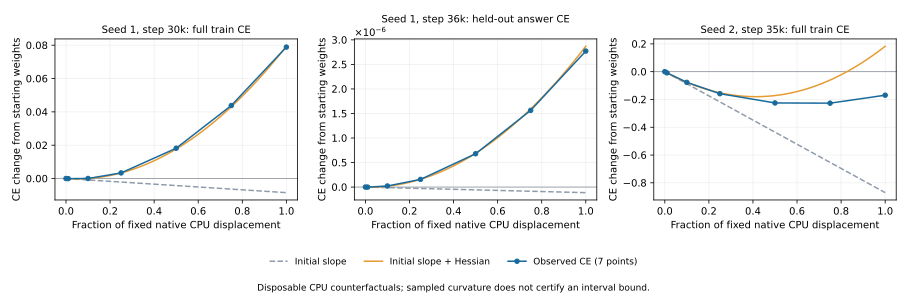
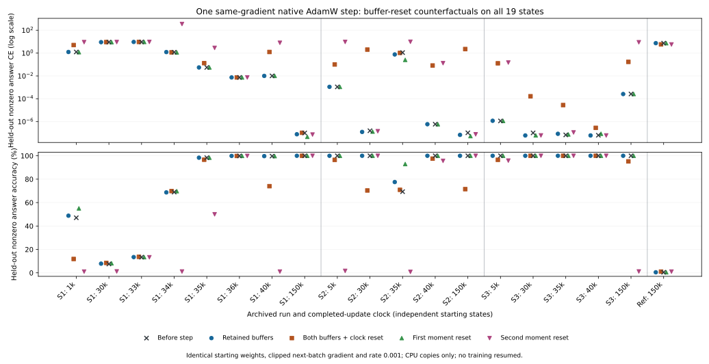

# Internal measurements during ordinary transformer grokking

Which internal observations distinguish rule formation from memorization
and confidence growth? Check all six proposed measurements: frozen linear
probes, gradient agreement, activation spectra, FFN neuron specialization,
causal ablations, and functional update decomposition.

The follow-up pair-removal studies are documented below: all 28 head pairs
at 23 immutable snapshots, with answer-only CE, computation-stage outputs
and explicit zero-quotient controls. They add observations, not training
variants.

| Run | Difference from grokking_progress | Budget |
| --- | --- | ---: |
| `gptmini-seed1` | Save every 1,000 updates instead of every 5,000 | 150,000 |

The ordinary GPTMini softmax architecture, native AdamW, data split and
seeds match the earlier delayed-generalization run. Measurements operate
on CPU copies of saved weights. Intermediate weights are retained by
`archive.py`, which also watches the original study's controls. No probe
changes a training model, its optimizer, sampler or random state.

The primary, repeat, seed 2 and reference control have completed their
full budgets. The repeat matches all 601 canonical observations of the
primary exactly. Seed 3 also completes all 150,000 updates. Seed 2's
brief earlier interruption before its first checkpoint remains documented
under `runs/gptmini-seed2/interrupted_before_first_checkpoint/`; the complete
run restarted from its same initialization. All budgets remain unchanged.

## Protocol

- Frozen linear readouts use ridge least squares on standardized **train
  features only**, with fixed strength 0.001. Held-out labels score the
  fitted readout. Shuffled training labels supply a negative control.
  Failure of this particular readout does not prove absent information.
- Gradients use `autograd.grad` on eight fixed, disjoint 32-example batches
  per split under the original answer-plus-EOS objective. Record pairwise
  cosines per parameter group and between split means. No gradient is
  applied. High agreement can arise from common targets such as EOS.
- Center activations and eigendecompose covariance on each split. Record
  `exp(entropy(eigenvalue / total))`, stable rank and the rank retaining
  99% energy. This is covariance-energy entropy, not singular-value entropy.
- Actual FFN post-activation neurons are measured before their output
  projection. Record exact zeros, train-RMS-relative zeros, train-selected
  class selectivity and train/held-out agreement of quotient profiles.
  Exclude the trivial zero quotient from neuron profiles.
- Remove each head's actual merged output after XSA and before its output
  projection, at every prompt position. Separately remove eight top or
  bottom train PCs and a matched random subspace at the answer-query
  residual, preserving its train mean. Record answer loss/accuracy changes
  on both splits. Off-manifold interventions measure named sensitivities.
- Between retained endpoints, project row-centered logit change onto the
  previous logits. Record scale and orthogonal-geometry energy shares,
  the fitted scale, changed predictions and scaling-only hypothetical CE.
  A negative fitted scale does not preserve decisions; a shrinking scale
  is not confidence growth. Multi-update intervals remain explicit.

Sources and deviations are documented in each module: Nanda et al.,
arXiv:2301.05217v1, sections 4–5; Golechha, arXiv:2405.12755v1, section
3.1; Prieto et al., arXiv:2501.04697v1, section 4.2. Local manuscripts
are in `papers/`. No mathematical guarantee is borrowed from them for
the actual ordinary-transformer training trajectory.

## Found around the measured transition

The repeated canonical train/held-out metrics agree exactly with the
original at every compared observation. The transition is reproduced:
first 99% held-out answer accuracy at 35,500, after the 33,000 structural
signal. All six probes have now measured the preserved pre-transition
and post-transition weights.

| Measurement | Update 30,000 | Update 35,000 |
| --- | ---: | ---: |
| Model held-out answer accuracy | 8.63% | 98.37% |
| Frozen block 1 residual probe | 8.48% | 97.34% |
| Frozen block 1 neuron probe | 8.42% | 98.41% |
| Shuffled-label residual probe | 1.16% | 0.54% |
| Block 1 residual energy entropy rank | 49.84 | 61.65 |
| Train-batch gradient mean pair cosine, all parameters | 0.0469 | 0.00311 |
| Train/held-out mean gradient cosine, all parameters | 0.0469 | 0.0334 |
| Block 1 FFN exact zero activation fraction | 83.74% | 82.49% |
| Median FFN quotient-profile agreement | 0.556 | 0.983 |
| Largest single-head held-out accuracy drop | 5.09 percentage points | 58.76 percentage points |

The fixed probes first exceed 99% at the 36,000 checkpoint, after the
model's 35,500 crossing. This decoder did not expose a hidden 99% solution
long before the model readout. Gradient agreement and sparsity do not
rise monotonically. Rank fluctuates strongly across nearby checkpoints.
None is a standalone grokking detector.

Between 34,000 and 35,000, **81.63%** of measured held-out logit-change
energy is orthogonal to a global rescaling of the previous logits. The
best fitted global scale is **0.778**, not an increase. The observed
accuracy gain in this interval involves changing decision geometry.

At the final original 150,000 checkpoint, removing block 0 head 2 reduces
held-out answer accuracy from 100% to zero. This demonstrates sensitivity
to removing that head; it does not establish the head's complete algorithm
or show when it first became necessary. The repeated checkpoints supply
the timing study.

The reference control completes 150,000 updates with 1.503% held-out answer
accuracy and a frozen probe near chance. Seed 2 completes 150,000 updates
with 100% accuracy and first exceeds 99% at 1,250 updates. Seed 3 first
exceeds 99% at 750 updates and completes at 100%. These two initializations
are early-generalizing controls, not replications of seed 1's long plateau.
Seed 2 temporarily loses accuracy at 35,000 and later recovers; that event
is not its first acquisition of a generalizing solution.

Sixteen focused tests pass on CPU and CUDA, including equality of actual
AdamW parameters, optimizer state, existing gradients and RNG through the
next update, intervention/capture cleanup after failures, a training-only
memorizer, fixed-probe held-out-label independence, exact known spectra
and confidence-only counterexamples. The complete `./make.py test` suite
passes: **249 tests in 1,181.248 seconds**, including available CUDA tests.

## Answer versus shared EOS gradients

`compare_objectives.py` adds offline observations on pinned available
checkpoints of the repeat, both seed controls and the reference. It leaves
the six-measurement worker and all training source unchanged. Each sampled
batch supplies three gradients from the same training forward: answer CE,
EOS CE, and the actual mean CE. The EOS position sees the supplied answer,
as it does during training. Batches and unique parameters, including tied
embedding/readout weights, match the existing gradient protocol.

The reader verifies `g_full = (g_answer + g_EOS) / 2` numerically, retains
the signed cross term in squared norms, and decomposes the train/held-out
mean-gradient dot product into four component terms. Those terms are not
nonnegative fractions; cancellation and cross-component alignment matter.

| Initialized model | Full train/held-out cosine | Answer cosine | EOS cosine | EOS–EOS contribution to full cosine |
| --- | ---: | ---: | ---: | ---: |
| GPTMini seed 1 | 0.9524 | 0.3154 | 0.9807 | 0.9297 |
| GPTMini seed 2 | 0.9581 | 0.2818 | 0.9781 | 0.9338 |
| GPTMini seed 3 | 0.9615 | 0.3567 | 0.9819 | 0.9712 |
| Reference control | 0.9886 | 0.7723 | 0.9954 | 0.9767 |

Shared EOS supervision supplies most of the full cosine's numerator at
initialization. It does not explain every early agreement: seed 1 at
1,000 updates has answer-only cosine 0.8567 while EOS contributes less
than 0.000001 to the full cosine. At the actual 30,000–35,000 transition,
answer-only cosine decreases from 0.0469 to 0.0336. Thus removing EOS does
not turn this measurement into a standalone detector.

[The component results](objective_component_results.json) retain 23
observations with checkpoint, source and batch hashes. Missing intermediate
reference weights are explicit; its first retained noninitial snapshot is
45,000. All four measured runs now include their final weights. Maximum
relative gradient-reconstruction error for all parameters is below
`5e-7`. Initialized-model records are distinguished from training weights.

Seven new tests cover opposing answers aligned by a shared signal, signed
cancellation, cross-component dot terms, the actual supervision mask,
unused/tied parameters, failure cleanup and unchanged next AdamW updates
on CPU/CUDA. The full suite passes **256 tests in 942.386 seconds**.
Reproduce from `python/` with `uv run --locked python
../experiments/grokking_internals/compare_objectives.py`; rerunning fills
newly available pinned snapshots without changing the recipe.

## Exact certificates for current answers

`compare_geometry.py` evaluates the Lean cleanup criterion on the same
23 pinned checkpoints. `compare_geometry_all.py` reads all **238**
preserved snapshots: 151 from the repeat, 2 from the original, 31 from each
of seeds 2 and 3, and 23 from the reference. These are observations of the
completed 150,000-update runs; no training budget or optimizer changes.
The pinned reader and the full reader agree exactly on every shared
measurement and checkpoint hash. Missing reference weights before 45,000
remain absent, apart from its initialization.

The reference is the actual held-out cell mean of raw logits, with class
bias retained. Align each observed row to the reference's row mean; this
changes no class ordering. For the correct reference margin `m > 0` and
that row's residual squared energy `R`, `2 * R < m^2` certifies its strict
correct answer. The reference is computed from the current outputs; it
is an offline diagnostic using target labels, not a decoder or supervision
added to training. All measurements below exclude the zero quotient.

`geometry_certificates.py` represents the finite observed binary logits
by exact integers with a common denominator. For `n` observations and
`C` classes, its residual numerator is
`n*C*x - n*row_sum - C*column_sum + total_sum`. With target column-sum
gap `g`, the exact test is `g > 0` and
`2 * sum(residual_numerator^2) < (C*g)^2`. No rounded squared energy
decides the certificate count. Quantiles, energy summaries and the signed
margin/error balance still use float64.

Lean's `Geometry.RowAlignment`, `IntegerEncoding` and `IntegerCertificate`
add eighteen proved identities and sufficient/necessary implications:
the integer test equals the real cleanup inequality, preserves positive
scale invariance and certifies the original raw row. The integer encoding
is an input; Python's float extraction, its program and the transformer's
floating-point forward execution are not formally verified.

| Seed 1 repeat update | Actual nonzero accuracy | Cell-mean nonzero accuracy | Exact certified fraction |
| --- | ---: | ---: | ---: |
| 33,000 | 13.39% | 25.38% | 0.00% |
| 34,000 | 68.97% | 99.11% | 0.22% |
| 35,000 | 98.35% | 100.00% | 27.79% |
| 36,000 | 99.87% | 100.00% | 95.94% |
| 38,000 | 99.96% | 100.00% | 99.72% |
| 40,000 | 99.70% | 100.00% | 50.93% |
| 150,000 | 100.00% | 100.00% | 100.00% |

The first preserved seed 1 cell-mean accuracy above 99% is at 34,000;
the first certified fraction above 99% is at 38,000. The separate canonical
evaluation, every 250 updates and including the zero quotient, first
exceeds 99% at **35,500**. There are no retained weights at 35,500 in this
reader. The cell projection supports the interpretation that a correct
functional component precedes stable raw decisions; it does not identify
an attention/FFN algorithm or prove how AdamW learned that component.

Across 1,159,032 current-input certificate evaluations, **759,256** tests
certify an answer and **zero** certified answers are incorrect. These are
applications across snapshots, not distinct examples. There are zero
exact/float64 predicate disagreements here, with maximum float64 energy
decomposition error below `1e-9`. Every snapshot meets the two-point
nonzero-cell coverage and energy protocol. The conservative certificate
using the global residual sum certifies no answers in any snapshot.

The sufficient certificate is not a monotone onset detector. Seed 1's
coverage falls at 40,000 while accuracy remains high. Seed 3 finishes
with 100% accuracy but 83.72% certificate coverage. Seed 2's loss of
accuracy at 35,000 also changes the cell reference. Seed 1's cell-mean
accuracy already reaches 59.60% at 1,000 updates, then falls during the
long plateau; that early rise alone does not predict sustained success.
The reference ends with 0.49% nonzero
accuracy and no certified answers; its previously reported 1.503%
canonical accuracy includes the zero quotient.

Ten new tests check an independent rational oracle, extreme binary
scales, the strict boundary, wrong symmetric references, class-bias
restoration, masked locality, sum/mean factors, scale invariance and
noninterference. The full suite passes **266 tests in 911.148 seconds**.
[Pinned results](geometry_certificate_results.json),
[all preserved results](geometry_all_results.json) and
[the figure](geometry_certificates.svg) retain the protocol and hashes.
Reproduce from `python/` with `uv run --locked python
../experiments/grokking_internals/compare_geometry.py`, then
`uv run --locked python ../experiments/grokking_internals/compare_geometry_all.py`.
For the figure use `uv run --locked --with matplotlib==3.10.8 python
../experiments/grokking_internals/plot_geometry.py`.

## Artifacts and thermodynamic interpretation

`internal_suite_results.json` now includes all five completed run records
and the canonical-repeat comparison. It pins checkpoint and source-prefix hashes,
observer code, sampled updates, raw metrics, and threshold crossings.
`six_measurements.svg` and `control_comparison.svg` are scientific figures.
Do not infer missing intermediate weights from connected curve segments.

The finite trajectory is compatible with a transition in representation
dynamics. A thermodynamic phase transition would additionally require
specified order/control parameters and an asymptotic regime. Neither an
effective temperature for AdamW nor finite-size scaling is established
here. Liu et al., arXiv:2205.10343v2, discuss an effective representation
theory; Žunkovič/Ilievski, arXiv:2210.15435v1, analyze solvable phase
transition models. Their assumptions are not transferred to GPTMini.
These measurements belong to the route list of
[grokking_lean_plan.md](../../grokking_lean_plan.md), closed on 2026-10-08;
the active plan is [grokking_plan.md](../../grokking_plan.md).

From `python/`, reproduce the snapshot with `uv run --locked python
../experiments/grokking_internals/summarize.py`, and figures with
`uv run --locked --with matplotlib==3.10.8 python
../experiments/grokking_internals/plot.py`. Run `archive.py` and `observe.py`
as long-lived read-only workers to retain and measure future checkpoints.

## Pairwise head interactions: retrospective sensitivity, not a detector

Does a useful multi-part computation become visible before the model
starts generalizing? The composition hypothesis in Nanda et al.,
arXiv:2301.05217v1, appendix Further speculations on grokking, motivates
measuring all four losses for every unordered pair of heads:

`I = L(both present) - L(A removed) - L(B removed) + L(both removed)`.

The Lean scalar specialization at commit `b141ba0` proves a negative
contrast for aligned components supplying a product logit. The real
transformer is measured separately: each head's merged output is removed
at all prompt positions, after XSA and before its projection. All four
answer-only CE losses, accuracies and changed predictions are retained
for both splits, including separate nonzero-quotient scopes. EOS is not
part of this measurement. No pair is fitted, selected using later weights,
or supplied to training. The analysis enumerates all eight heads and all
28 pairs at every available pinned snapshot.

`pair_interactions.py` defines the observation and `compare_interactions.py`
reads the same pinned steps as the objective-components study. Run from
`python/` with `uv run --locked python ../experiments/grokking_internals/compare_interactions.py`.
SHA-256 identities pin source, task rows and each actual checkpoint. Modes,
RNG, weights, buffers and gradients are retained; temporary hooks are
removed even on failure. Missing weights are recorded, not reconstructed.
The four reference snapshots at 5k, 30k, 35k and 40k remain unavailable.
The completed [result](pair_interaction_results.json) contains 23 snapshots
and 644 pair observations. Each declared training run remains at its
completed 150,000-update budget.

Count a pair only when both individual removals increase the measured
loss and `I` is negative beyond the declared heuristic tolerance
`1e-9 + 1e-7 * max(abs(corner losses))`. This tolerance is not a proved
floating-point error bound. The following table uses held-out **nonzero**
quotients throughout:

| Seed 1 update | Answer accuracy | Counted pairs, out of 28 |
| ---: | ---: | ---: |
| 0 | 0.33% | 4 |
| 1,000 | 47.04% | 20 |
| 30,000 | 7.56% | 0 |
| 33,000 | 13.39% | 3 |
| 34,000 | 68.97% | 7 |
| 35,000 | 98.35% | 3 |
| 36,000 | 99.87% | 9 |
| 40,000 | 99.70% | 7 |
| 150,000 | 100% | 13 |

The count is nonmonotone and already substantial at 1k, followed by much
poorer accuracy at 30k. The most negative eligible contrast is about
`-8.03` at 1k, versus `-0.19` at 35k. Neither count nor magnitude alone
is a forecast of the later transition. Early-generalization controls
also have eligible pairs at initialization: six in seed 2 and two in
seed 3. Their first 99% canonical crossings remain 1,250 and 750,
respectively; the sparse intervention snapshots do not redefine them.

At the completed budget, using nonzero quotients on both splits:

| Run at 150k | Held-out accuracy | Counted train pairs | Counted held-out pairs |
| --- | ---: | ---: | ---: |
| Seed 1 | 100% | 13 | 13 |
| Seed 2 | 100% | 14 | 14 |
| Seed 3 | 100% | 4 | 4 |
| Reference, 20% training fraction | 0.49% | 28 | 0 |

Every pair meets this criterion on the failed reference's **training**
examples, while no pair does on its held-out examples. Thus useful
training interactions do not certify a transferable rule. Different
100%-accurate seeds also have different counts. The reference's 0.49%
nonzero accuracy is distinct from its 1.50% all-quotient accuracy; the
trivial zero quotient is an explicit confound rather than hidden evidence.

A negative contrast can arise from opposed additive scores with no
product logit, as the numerical control tests demonstrate. Even paired
removal is an off-manifold intervention with downstream nonlinearities;
it does not recover a unique head algorithm, establish a causal training
mechanism or prove a thermodynamic transition. The full four-corner data
support named sensitivity comparisons, not a universal grokking metric.

Lean also proves the stronger two-example counterexample in
`Transformer.Grokking.Composition.AdditiveContrast`: additive scores
`2*a-b` and `2*b-a` give negative mean-CE interaction and **both** useful
individual removals at `(1,1)`. Their actual mixed score derivatives
and four-corner score contrasts are nevertheless zero. The loss can
create the interaction pattern by itself. The follow-up below retains
four-corner logit contrasts before CE, removing common row shifts, and
distinguishes normalization and downstream FFN nonlinearities.

Validation on 2026-10-08: `./make.py check experiments/grokking_internals`
and the full `./make.py test` pass (275 tests, including nine new pair
controls/noninterference checks). Lean build, audit, generated index and
forbidden checks pass; no new sorry or additional axioms were introduced.

## Output interactions at actual computation stages

`compare_output_interactions.py` observes all 28 pairs at the same 23
snapshots, retaining the earlier CE reader and results unchanged. For
each pair, capture all four actual states at equals: attention output
projections, FFN output projections, block residuals, final normalization
and answer logits. Compute `I = z11 - z01 - z10 + z00` before applying
loss. Center each logit row across all classes; intermediate feature
coordinates remain uncentered. Common row offsets are invisible to
softmax. Fixed class bias cancels from the contrast but is retained in
the hypothetical additive output `z01 + z10 - z00` when scoring answers.
All scopes below exclude the zero quotient.

Report relative interaction energy as the mean squared centered logit
contrast divided by the sum of the two single-removal change energies.
An explicit energy floor retains `None` for an uninformative denominator.
No head pair is selected or fitted. The three-corner reconstruction is
arithmetic on observed outputs, not a separately trained architecture.

| Seed 1 update | Actual accuracy | Median relative interaction, 28 pairs | Reconstruction accuracy range, 28 pairs |
| --- | ---: | ---: | ---: |
| 1,000 | 47.04% | 0.2963 | 1.80–42.89% |
| 30,000 | 7.56% | 0.2809 | 4.02–8.52% |
| 33,000 | 13.39% | 0.2261 | 5.24–14.04% |
| 34,000 | 68.97% | 0.1476 | 41.35–69.90% |
| 35,000 | 98.35% | 0.1499 | 65.25–98.39% |
| 36,000 | 99.87% | 0.2171 | 64.60–99.85% |
| 150,000 | 100.00% | 0.3163 | 27.51–100.00% |

The relative interaction is higher at step 1,000 than at the transition,
so its magnitude is not a monotone detector. At 150k the failed reference
has median relative interaction **0.3212** with only **0.49%** accuracy,
comparable to seed 1's **0.3163** at 100% accuracy. Nonlinear output
interaction therefore does not certify rule learning. At the final
successful seed 2 and seed 3 states, reconstruction accuracy ranges over
pairs are 0–100% and 9.56–100%. Some pair interactions affect decisions
strongly, while others leave every answer correct.

For same-block head pairs, their own attention-projection contrast has
RMS between `2.52e-9` and `9.00e-8` across all 276 observations. This
finite float32 residual is compatible with an affine projection plus
rounding. Their downstream FFN contrast is positive in all 276 cases,
with RMS between `0.001217` and `1.09648`. A real-block float64 control
checks an almost-zero affine contrast and a nonzero downstream FFN
contrast, and a cross-block intervention leaves earlier causal stages
unchanged. Final-output interaction alone cannot identify a learned
cross-layer attention computation.

Lean's `Composition.OutputInteractions` derives actual class centering,
zero-energy invariance of CE and strict decisions, and the per-row
sufficient condition `2 * interactionEnergy < current_margin^2` for
correct additive reconstruction. Positive interaction can also preserve
all decisions. Lean uses a coordinate sum; the observation reports
coordinate/example means, and does not verify the theorem's per-row
margin hypothesis. The binary-endpoint counterexample additionally shows
that zero removal contrast can miss an interaction at interior gate
values. Neither observed float64 summaries nor endpoint removals certify
a global computation or causal training dynamics.

[The completed results](output_interaction_results.json) contain 644
pair observations with eight stages for each GPTMini and seven for the
reference without final normalization, checkpoint/source hashes,
four split/quotient scopes, reconstruction decisions and margins against
the fixed baseline's strongest wrong class. Four missing intermediate
reference weights remain explicit. Ten new controls check loss-induced
false interactions, row-offset and scale invariance, endpoint blindness,
nonlinear stage separation, and preservation of weights, gradients, modes,
RNG and hooks, including failure cleanup. The complete suite passes
**285 tests in 888.098 seconds**. Reproduce from `python/` with
`uv run --locked python ../experiments/grokking_internals/compare_output_interactions.py`.

## Archived momentum and the next stochastic direction

`compare_momentum.py` reads actual optimizer and sampler states at the
19 noninitial pinned snapshots. The four seeded initial weight files
have no archived moment/sampler state and are explicitly excluded; four
intermediate reference weights are still missing. Every original
150,000-update run stays completed. One disposable CPU model/optimizer
copy takes the minibatch selected by restoring the checkpoint's sampler
and uses the next scheduled rate, original clipping and native AdamW.
The copy is discarded, including probes from the final checkpoints.
This is a counterfactual CPU observation, not resumed CUDA training.

Before the update, compute exhaustive gradients of the current answer CE,
EOS CE and original averaged CE on each train/held-out all/nonzero
population. Every chunk contributes its sample-count weight; small tails
do not receive the weight of full chunks. These diagnostic gradients
never feed the update. Exhaustive diagnostics use evaluation mode; the
disposable native update uses training mode. Tied parameters appear once
in registration order.
Read the retained buffer direction, the newly corrected adaptive
direction, decoupled decay, their total, and the actual finite CPU
displacement. Their dot products distinguish alignment with the restored
minibatch from alignment with the entire training or held-out objective.

The estimated loss-rate derivative is `-gradient dot down_direction`.
It describes a local affine parameter path with the computed direction
held fixed. Recompute the losses after the actual finite step as a
separate observation. All rows below use rate `0.001`, and the held-out
column excludes the zero quotient.

| Seed 1 update | Estimated held-out answer CE slope | Finite held-out answer CE change | Finite full train CE change |
| --- | ---: | ---: | ---: |
| 1,000 | -95.746 | -0.0048513 | -0.0014784 |
| 30,000 | -153.054 | -0.1044663 | +0.0788875 |
| 33,000 | +2.539 | +0.0025951 | -9.99e-10 |
| 34,000 | +12.133 | +0.0370853 | +0.0022819 |
| 35,000 | -0.094935 | -9.35e-5 | -7.95e-8 |
| 36,000 | -0.00011245 | +2.77e-6 | -1.66e-9 |
| 40,000 | -0.049068 | -4.78e-5 | -1.28e-7 |
| 150,000 | -4.76e-6 | -2.28e-8 | -1.29e-8 |

Every measured total direction has a negative estimated derivative for
the exhaustive original training loss and for its next minibatch.
Nevertheless, the finite full training loss increases in **3 of 19**
probes. Local alignment therefore does not supply a safe finite rate.
The held-out answer loss increases at 33k and 34k despite the subsequent
canonical grokking transition. At 36k its local slope and finite change
have opposite signs. Three more such sign disagreements occur in early
learning controls near very low losses. These remain uncertified
floating-point observations; their small differences do not identify
rounding versus curvature without additional error bounds.

The failed reference's final step decreases full train CE by `0.0009144`
while increasing held-out nonzero answer CE by `0.0159453`; its estimated
held-out answer slope is `+74.164`. The retained-buffer direction alone
has slope `-80.260`, the new adaptive direction `+84.067` and decay
`-9.903`. Reading old momentum alone therefore misses the new gradient
and preconditioner. For seed 1 at 33k, decay contributes `-1.105` but
the adaptive term `+3.644`, giving a total slope `+2.539`. Decay does
not ensure held-out descent in these observed states.

Lean's existing `SecondStep` and reachable `MomentumCounterexample`
separate local alignment from guaranteed descent. The new
`CoupledFirstStep`/`CoupledThreshold` results additionally derive growth
for the actual scalar compositional CE under **zero** moment buffers:
`decay*(s + epsilon*(exp(s^2)+1)) < 1`. Some positive growing amplitude
exists iff `decay < 1/(2*epsilon)`; it reduces CE while preserving an
already correct binary decision. This fresh-buffer, unit-CE threshold
is not assigned to the archived answer/EOS objective or its accumulated
moments. None of these theorems verifies the numerical gradient program
or supplies multi-step GPTMini rule convergence.

[The completed results](momentum_direction_results.json) retain every
checkpoint hash, restored next-batch hash, moment clock, objective,
four exhaustive populations and before/after losses. The maximum
relative full-versus-component gradient discrepancy is `3.48e-7`;
the relative finite-displacement versus algorithm-direction discrepancy
is at most `2.81e-4`. Float64 statistics do not turn their float32
inputs into exact certificates. Eight new controls check an independent
full-batch gradient oracle, weighted tails, a separately restored native
EagerStepper, zero-quotient scopes, noninterference and failure cleanup,
invalid clocks/variance/registration, and the reachable scalar momentum
counterexample. Reproduce from `python/` with
`uv run --locked python ../experiments/grokking_internals/compare_momentum.py`.
The full `./make.py test` passes **293 tests in 904.206 seconds**;
experiment check, Lean build/audit, generated index and forbidden checks
pass. No training implementation or earlier observer/result is modified.

## Curvature along the same native CPU displacement

Can curvature explain a finite CE increase despite a negative current
directional derivative, and does the initial Hessian predict the endpoint?
`compare_curvature.py` reads the same **19 noninitial checkpoints**, excludes
the four weight-only initializations and records the same four missing
reference checkpoints. It restores the native moments and next minibatch,
makes one disposable CPU step, then holds its observed displacement fixed.
These are counterfactual CPU curves; no archived CUDA run resumes or changes
its 150,000-update budget.

| Measurement | Objective | Positions and derivatives |
| --- | --- | --- |
| `train_all` | Exhaustive mean of the original full answer/EOS CE | CE, slope and answer accuracy at seven endpoint fractions; autograd HVP at five |
| `heldout_nonzero` | Exhaustive nonzero-quotient answer CE | The same fractions and derivatives, on the held-out population |

Fractions are `0, .01, .1, .25, .5, .75, 1`, with HVP at
`0, .25, .5, .75, 1`. The down direction is the observed parameter
displacement divided by the original scheduled rate, not a recomputed
optimizer direction. Float64 endpoint interpolation is rounded back to
the original float32 model, and HVP directions are cast to that dtype.
The native softmax implementation is already unfused and supports second
autograd derivatives; no attention backend or model is substituted.
Sample weighting includes the final short chunk. The completed curves
use 396.64 summed elapsed observation seconds on a four-thread CPU reader.
Their endpoint CE agrees with
the independent frozen momentum reader to at most `1.78e-15`, initial
directional slopes to `1.60e-14`, and answer accuracies and restored
minibatch hashes exactly.

The initial linear prediction is `rate * slope`; the quadratic prediction
adds `rate^2 * curvature / 2`. Both use the current fixed displacement.

| Checkpoint / objective | Linear prediction | Initial quadratic prediction | Observed finite CE change |
| --- | ---: | ---: | ---: |
| Seed 1, 30k / full train | -0.0084840 | +0.0793812 | +0.0788875 |
| Seed 1, 34k / full train | -0.0005740 | +0.0019078 | +0.0022819 |
| Seed 1, 36k / held-out answer | -0.0000001140 | +0.0000028700 | +0.0000027717 |
| Seed 2, 35k / full train | -0.8707075 | +0.1829553 | -0.1692601 |
| Seed 2, 35k / held-out answer | -1.8424790 | +0.2988185 | -0.3467655 |
| Failed reference, 150k / held-out answer | +0.0741640 | +0.0184538 | +0.0159453 |

Curvature accounts well for the primary 36k held-out discrepancy: its
initial answer CE is `0.00739248`, so the finite increase is not a
zero-loss observation. The large primary train increases also have the
same sign and close size as their quadratic predictions. Across all
states the quadratic sign agrees with the measured endpoint in **15/19**
train cases and **16/19** held-out cases. This is descriptive endpoint
agreement, not a grokking detector or a certified accuracy rate.

The seed 2 35k counterexample is substantial: both objectives decrease
even though both initial quadratic predictions increase. Train curvature
falls from `2.107e6` to about `0.931e6` along the sampled segment, so the
initial value is a poor approximation to the weighted interval curvature.
The other sign disagreements occur at very small losses/changes and
remain unresolved between curvature variation and floating-point effects.
For seed 1 34k, sampled train curvature rises from `4963.69` to `9256.53`
at the halfway point; the initial value is not even an observed upper bound.

`Transformer.Grokking.AdamW.CurvatureBound` proves an exact-real finite
descent bound from an actual derivative envelope **throughout the update
interval**. `CurvatureCounterexample` constructs ordinary binary CE curves
with the same initial loss, slope and Hessian but arbitrarily different
finite behavior over the family. Neither theorem equates sampled HVP with
that interval premise. The measured curves and quadratic crossing rates
are uncertified float32 diagnostics, including rounded interpolation and
activation boundaries. No causal multi-step or generalization theorem is
obtained from the local fit.

[All observations](curvature_profile_results.json) pin every checkpoint,
source file, next minibatch and frozen momentum-data hash. Seven new controls
check analytic CE/HVP values, weighted feature means, independent central
loss differences, opposite finite CE behavior with equal initial data,
native GPTMini endpoint agreement, noninterference/failure cleanup and
invalid states/directions. Reproduce from `python/` with
`uv run --locked python ../experiments/grokking_internals/compare_curvature.py`,
and plot with `uv run --locked --with matplotlib==3.10.8 python
../experiments/grokking_internals/plot_curvature.py`.
The full `./make.py test` passes **300 tests in 915.584 seconds**;
the experiment check and Lean build/audit/index/forbidden checks pass.

## Same-gradient native-moment reset counterfactuals

How much do the actual archived moment buffers change the next step,
independently of its starting weights and clipped minibatch gradient?
`compare_moment_resets.py` reads the same **19 noninitial states**, records
four missing reference states and excludes four weight-only initializations.
It restores the actual next sampler batch, computes and clips its gradient
once, and copies that gradient into four disposable native CPU optimizers.
Every branch starts from the same archived weights and uses the original
scheduled rate `0.001`. The retained branch loads the actual saved buffers.

| Branch | First buffer before gradient insertion | Second buffer before insertion | Bias clock after insertion |
| --- | --- | --- | --- |
| `retained` | Archived first moment | Archived second moment | Original clock + 1 |
| `fresh_adamw` | Zero | Zero | 1 |
| `reset_first_moment` | Zero | Archived second moment | Original clock + 1 |
| `reset_second_moment` | Archived first moment | Zero | Original clock + 1 |

The completed observations use **95.69 summed elapsed seconds** on a
four-thread CPU reader. The retained branch reproduces the frozen momentum
reader's restored batch hashes, gradient norms, direction norms, exhaustive
before/after CE, answer accuracy and directional derivatives **exactly** on
both populations at all 19 states. No CUDA trajectory resumes, no training
update is inserted and every original 150,000-update budget stays unchanged.

| Starting state | Before: held-out nonzero answer CE | Retained | Both + clock reset | First reset | Second reset |
| --- | ---: | ---: | ---: | ---: | ---: |
| Seed 1, 34k | 1.19208 | 1.22916 | 1.16114 | 1.15451 | 352.39542 |
| Seed 1, 35k | 0.0553758 | 0.0552823 | 0.1311524 | 0.0554014 | 2.8547111 |
| Seed 1, 40k | 0.0101112 | 0.0100634 | 1.2551925 | 0.0101152 | 7.9809489 |
| Seed 2, 150k | 1.04e-7 | 6.89e-8 | 2.2553223 | 5.39e-8 | 7.73e-8 |
| Failed reference, 150k | 7.41274 | 7.42869 | 5.81549 | 7.37984 | 5.69448 |

These cells are CE **after one step from independent archived states**.
At seed 1 34k, erasing only variance expands the total algorithm-direction
norm from about `145.30` to `3.840e5`; the archived first moment now lacks
its old variance denominator. Held-out accuracy falls from `68.97%` to
`1.11%`, compared with `68.71%` after the retained step. At seed 1 35k,
variance erasure lowers accuracy to `50%`; at 40k it lowers it to `1.06%`.
This demonstrates a large same-gradient next-step dependence on optimizer
state, rather than a failure to store the rule in the starting weights.

The early-learning controls reject sensitivity to resetting AdamW as a
standalone signal of grokking's onset. Seed 2 at 150k starts with `100%`
held-out accuracy, remains there with retained buffers and falls to `71.49%`
with a fresh optimizer. Seed 3 at 150k falls from `100%` to `1.17%` under
variance-only erasure. Conversely, resetting the first moment at seed 2
35k gives `92.94%` versus the retained branch's `77.55%`, but this checkpoint
is a temporary loss of an already acquired solution, not its first onset.
The failed reference remains near chance in every branch despite its
large answer-CE decrease under two resets.

Across all states, held-out answer CE increases in `8/19` retained,
`14/19` fresh, `6/19` first-reset and `13/19` second-reset observations.
Train full CE increases in `3/19`, `16/19`, `8/19` and `14/19`, respectively.
These descriptive counts include tiny floating-point changes and are not
statistical estimates of a reset's safety or benefit. First-moment erasure
also changes magnitude even in an aligned history: Lean derives the
constant-gradient factor `(1-beta1)/(1-beta1^(clock+1))`, about `0.1` at
these large clocks. A better endpoint does not isolate misalignment removal.

`Transformer.Grokking.AdamW.MomentRecurrence`, `MomentBounds`, `MomentMemory`
and `PartialReset` derive corrected histories, causal bounds, exact direct
buffer forgetting and the partial-reset formulas. Erasing variance cannot
reduce absolute adaptive direction at a fixed numerator and current gradient;
erasing the first moment restores scalar adaptive-current-gradient alignment.
Neither claim includes the finite rate, decoupled decay or generalization.
At the lab betas, direct old-buffer contributions attenuate below `1e-4`
after 100/500 identical-gradient insertions. Different parameters generally
produce different later gradients, so this is not a forgetting theorem for
the full training system or a derivation of the delayed transition time.

[The complete results](moment_reset_results.json) pin sources, checkpoint
hashes, batch hashes, clocks, branch directions and full/answer/EOS objectives.
The maximum relative finite-displacement versus algorithm discrepancy over
the four branches is `4.42e-4`; these float32 CPU updates remain uncertified.
Seven new scientific controls check partial-buffer/clock isolation,
independent retained/fresh native EagerStepper updates, preservation of the
supplied state and its next update, failure cleanup, invalid registration
and clocks, negative variance rejection, and first-moment erasure reversing
the reachable scalar-quadratic momentum counterexample at the observed rate.
Reproduce from `python/` with `uv run --locked python
../experiments/grokking_internals/compare_moment_resets.py`; plot with
`uv run --locked --with matplotlib==3.10.8 python
../experiments/grokking_internals/plot_moment_resets.py`.
The full `./make.py test` passes **307 tests in 943.004 seconds**;
experiment check, full Lean build, audit, generated index and forbidden
checks pass. The moment theorems are committed as `afffd88`.
